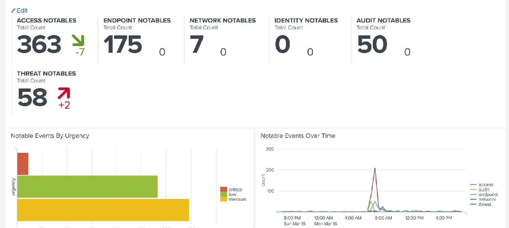
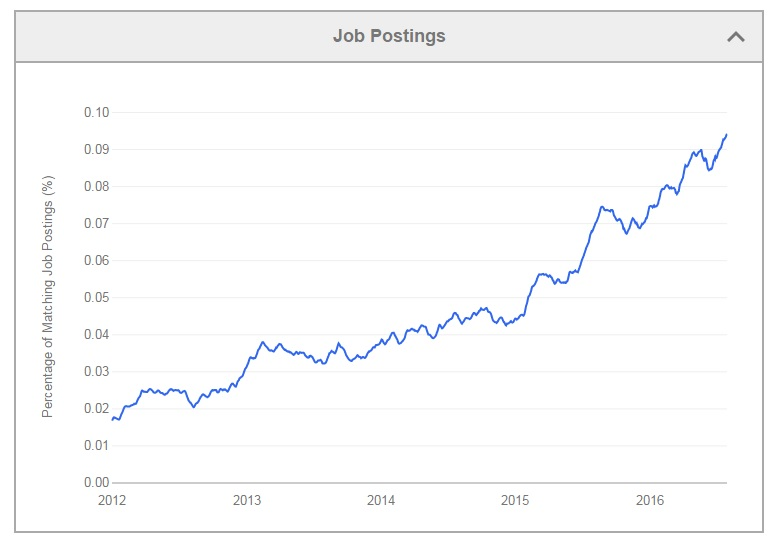
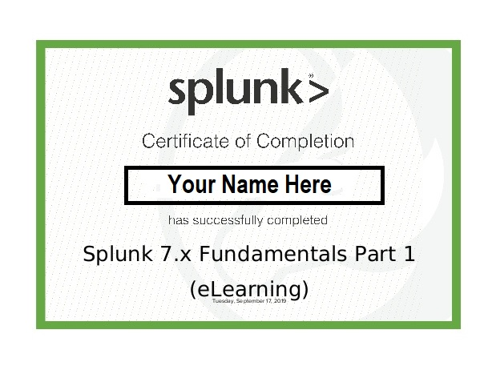

## 19.2 Lesson Plan: Advanced Security Monitoring Tools

### Overview

In today's class, students will learn about advanced monitoring tools that security professionals utilize to monitor and analyze security events. Then we will explore career paths and certifications related to Splunk and SIEM skills. We will conclude by completing several modules of the Splunk Fundamentals Certification.

### Class Objectives

By the end of class, students will be able to:

  - Differentiate between various advanced security monitoring solutions, such as SOARs, UBAs, and UEBAs and determine which is most appropriate for a specific security situation.

  - Understand how knowledge of SIEM software and Splunk is valued in the information security job market.

  - Work towards a Splunk certification using the Splunk Fundamentals eLearning program. 

### Slideshow

The lesson slides are available on Google Drive here: [19.2 Slides](https://docs.google.com/presentation/d/12wxXlRDhhBY4YZo3aN8vK892Lk_eRAR8-w1RQfKgBPU/edit#slide=id.g4789b2c72f_0_6)

- To add slides to the student-facing repository, download the slides as a PDF by navigating to File > "Download as" and choose "PDF document." Then, add the PDF file to your class repository along with any other necessary files.

- **Note:** Editing access is not available for this document. If you or your students wish to modify the slides, please create a copy by navigating to File > "Make a copy...".

### Time Tracker

The time tracker is available on Google Drive here: [19.2 Time Tracker](https://docs.google.com/spreadsheets/d/1K112UYTZdbR03-TF4ZkoHtMkRN74fyaBF-4zdboa2iA/edit#gid=1145703143)

- **Note:** Editing access is not available for this document. If you or your students wish to modify the slides, please create a copy by navigating to File > "Make a copy...".

### Student Guide

- [19.2 Student Guide](StudentGuide.md)

-------

### 01. Instructor Do: Introduction to Advanced Security Monitoring Tools  (0:15)

Begin class by welcoming the students back and informing them that today we will be learning about other information security products used by security organizations.  

  - We will begin by briefly introducing Splunk's SIEM product, Enterprise Security, and then explore several other security products available in the marketplace. 

  - Then, we will focus on security careers relevant to the knowledge and tools learned in the last five classes. 
  
  - After the break, we will introduce and work towards the Splunk Fundamentals Certification.

## Splunk ES

Remind the class that over the past five classes, we covered many of Splunk's capabilities and add-on applications. 

  - Explain that while these Splunk capabilities can assist in security investigations, Splunk has a SIEM product specifically designed to assist security professionals.

Explain that Splunk's SIEM product is called **Splunk Enterprise Security** or **Splunk ES**.
  - Splunk ES provides security professionals insights from machine-generated data, such as:
    - Network devices like routers and firewalls
    - Endpoint devices like antivirus solutions
    - Vulnerability management systems like Nessus

Explain that Splunk ES is one of the most popular add-on products for security professionals as it has pre-built dashboards, reports and built-in features:

Splunk ES features allow you to:
  - Identify, prioritize, and investigate security events.
  - Gain insights into security events.
  - Monitor the status of your security environment.
  - Audit your security events.
  - Navigate these tasks with a pre-built, easy-to-use interface.
  
Point to the following image to illustrate the how the Splunk ES Dashboard can be used to help monitor security events:

   
    
Point out that learning the capabilities of Splunk ES is out of the scope of this class, but if the students are interested in researching the capabilities offered by Splunk ES, they can explore the following resources on their own time:

   - [Splunk: ES Video Demo](https://www.youtube.com/watch?v=HN4zGIyi3PI)  
   - [Splunk: ES Documentation](https://docs.splunk.com/Documentation/ES)
   
## Advanced Security Monitoring Solutions  

Explain that while SIEM products such as Splunk ES provide many monitoring benefits, organizations are now integrating  **advanced security monitoring solutions** into their businesses to provide additional protection.
 
Introduce advanced security monitoring solutions by covering the following:
  
  - The core goal of all security monitoring solutions is to assist with detection of information security events.

  - Advanced security monitoring solutions provide additional benefits such as machine learning, artificial intelligence, automation and response.

  - The most popular advancements in the information security industry are:

    - User behavior analytics (UBA)
    - User and entity behavior analytics (UEBA)
    - Security orchestration, automation and response (SOAR) 
 

**UBA** is a security monitoring tool that  uses machine learning, artificial intelligence, and data processing to detect abnormalities in user activity.

  - UBA gathers information about typical user behaviors and creates baselines.
    - For example, UBA can gather information on the servers and systems that a user accesses as well as when and how frequently they do so. 

    - UBA can then create alerts for when a user's activity deviates from this typical behavior. 

    - If a user usually only logs onto a server between 9 a.m. and 5 p.m., Monday through Friday, UBA would create an alert if the user logged in on at 2 a.m. on a Saturday.

**UEBA** is a security monitoring tool similar to UBA, except it extends its monitoring to other "entities."
  - Entities can include routers, servers, and IoT (Internet of Things) devices.   

  - UEBA looks at normal user and entity behaviors, and creates alerts when users or entities show abnormal activity.
 
**SOAR**, comparable to a SIEM, automates security processes and responds to security incidents.
  - Examples of automating security processes include:
    - Creating logging.
    - Assigning priorities to security incidents.

  - Examples of responding to security incidents include:
    - Launching security investigations.
    - Threat mitigation.
   
  - Similar to a SIEM, SOAR gathers machine data from multiple entities and analyzes the data for security events.
    - SOAR uses **playbooks**, which detail the processes and response actions for specific event.

    - Playbooks are designed and configured by each organization.
      - For example, an organization can design a playbook to automate the response to a phishing incident.
        - The below image illustrates how SOAR uses a playbook to automate each step of the response.

        - This diagram also illustrates how using SOAR playbooks can decrease incident response time.

   
             
        
In the next activity, students will research the different vendors that offer these advanced security monitoring tools and learn about the different capabilities of each product.
 

### 02. Student Do: Advanced Security Monitoring Tools (0:20)

Explain the following to students:

- OMP management has approved a larger budget for the SOC to enhance the security monitoring. 
- You are tasked with researching several SOAR, UBA, and UEBA vendors to provide a summary to your management about the products you are recommending.

:globe_with_meridians: This activity will use **breakout rooms**. Assign students into groups of 3-5 and move them into breakout rooms.

Send students the following:

- [Activity File: Advanced Security Monitoring Tools](activities/05-Advanced-Security-Monitoring/Unsolved/README.md)

### 03. Instructor Do: Advanced Security Monitoring Tools Activity Review  (0:10)

In this activity, students were tasked with researching several security products and providing a summary of their findings.

Completing this activity required the following steps:

  - Researching the various security products available from a variety of vendors.

  - Selecting advanced security monitoring products from the provided sites.

  - Researching and summarizing the findings from the products selected.
  
Responses will vary. Conduct an open discussion about each students' answers. 
  
  

### 04. Instructor Do: Splunk Careers  (0:15)

Explain that we will now examine how the Splunk knowledge and tools learned over the past five days can apply to careers and certifications in the information security industry. 

  - Point out that even if an employer doesn't use Splunk, many Splunk skills can be easily applied to other vendors and similar products.

  - For example, if a security professional who is familiar with Splunk ES takes a position at an organization that uses LogRhythm, they should be able to note the similar core capabilities and quickly adapt to the different software. 
    

Explain that Splunk skills is a desireable qualification for many infosec positions. For example: 

  - **SOC analysts** work in a Security Operations department alongside security engineers. Their positions involve detecting, containing, and potentially remediating information security threats. Most SOC analysts use SIEM products, such as Splunk ES, to monitor their environment.
  
  - **Cyber threat analysts** analyze an organization's networks and applications to protect organizations from cybercriminals. Cyber threat analysts often use Splunk products to make predictions about cybercriminals and what attacks they may conduct.
  
  - **Application security engineers** can use Splunk to fix web and mobile application vulnerabilities. AppSec engineers use Splunk to analyze their application logs to assist with creating and testing their remediation.
  
  - **Network security administrators** use products like Splunk to monitor suspicious network traffic, such as DDOS attacks. They can use the findings from Splunk logs to mitigate and prevent against future attacks.
  
  - **Incident response managers** can use Splunk to monitor the status of ongoing security investigations when an incident has occurred.
  
Explain that some of these positions, such as the SOC and threat analyst, may use Splunk products as part of their primary responsibilities.

  - Other security positions, such as application security administrators, may only use Splunk for a small portion of their tasks.

  - Either way, understanding how to use Splunk is a valuable skill for information security professionals.
  
Splunk is already a required skill in many roles, and the industry demand is increasing every year.
  - Point to the following chart to illustrate the growth in demand.
  
   
   ([Source: Edureka](<https://www.edureka.co/blog/splunk-careers-big-data-jobs/>))
  
In the next activity, students will search through several job sites to find positions where Splunk is either a required skill or a primary responsibility.

### 05. Student Do: Splunk Careers (0:15)

Explain the following to students:

- For the following activity, you will search job sites for Splunk-related roles and answer provided questions about each position.

:globe_with_meridians: This activity will use **breakout rooms**. Assign students into groups of 3-5 and move them into breakout rooms.

Send students the following:

- [Activity File: Splunk Careers](activities/09-Splunk-Careers/Unsolved/README.md)

### 06. Instructor Review: Splunk Careers Activity  (0:10)

This activity illustrated the value of Splunk in the current information security job market. Students were tasked with researching jobs that require Splunk skills.

Completing this activity required the following steps:

  - Using several job sites to research jobs with Splunk skills.

  - Answering several questions on their findings.

Discuss the students' findings with an open discussion.

### 07. Break (0:15)
    

### 08. Instructor Do: SIEM Certifications  (0:15)

Welcome the students back from break and explain that, similar to other domains in cybersecurity, Splunk skills are validated through certifications. These allow candidates to prove they have the required skills to assist an organization.

- Having a certification can help a cyber professional acquire a new position or receive a promotion, and can provide networking opportunities with professionals who have similar certifications. 

Introduce the following certifications that Splunk offers:

- **Splunk Core Certified User**: Entry-level certification that demonstrates a user's basic ability to use the Splunk software.

- **Splunk Core Certified Power User**: Demonstrates a user's foundational skills with Splunk’s core software, in addition to more complex skills such as creating calculated fields and data models.

- **Splunk Core Certified Advanced Power User**: Demonstrates a user's capability to design reports, complicated searches, and dashboards.

- **Splunk Enterprise Certified Admin**: Focuses on an individual's ability to support daily administrative tasks using Splunk Enterprise software.

- **Splunk Enterprise Certified Architect**: Focuses on a Splunk administrator's role to support advanced troubleshooting, configurations, and deployments within Splunk Enterprise.

- **Splunk Enterprise Security Certified Admin**: Focuses on a Splunk administrator's role to support installation, advanced troubleshooting, configurations, and deployments with Splunk Enterprise Security environment.
  
**Instructor Note:** If the students are interested in learning more about the tracks and certifications Splunk offers, send out the following link: 
  - [Splunk: Training](https://www.splunk.com/en_us/training.html)

Explain that, like many certifications in the infosec field, most of these certifications are expensive. Many of them cost over $2,000.
 
- Fortunately, Splunk offers the first certification class, **Splunk Fundamentals 1** for free. There is only an exam fee of approximately $100.
  
Explain that in the final activity of the day, students will:
  - Set up a Splunk account.
  - Register for the Splunk Fundamentals 1 eLearning Course.
  - Complete the first three modules of the course.

Explain that each student will have to independently complete the remaining modules, sign up for the certification exam, and take the exam.

Ask the students if they have any questions before proceeding to the final activity.

### 09. Student Do: Splunk Certification  (1:00)

Explain the following to students:

- For the remainder of the class, you will register for and begin the **Splunk Fundamentals Certification**.

- You must register for a Splunk account and complete the certification registration.

- Once the registration is completed, you will complete the first three modules of the Splunk Certification.

Send students the following:

- [Activity File: Splunk Certification](activities/12-Splunk-Certifications/Unsolved/README.md)

### 10. Instructor Review: Splunk Certification Activity  (0:05)

The goal of this activity was to introduce the students to the Splunk Fundamentals eLearning Course. Students were tasked with completing several modules from the Splunk Fundamentals eLearning course. 

Completing this activity required the following steps:

- Registering for a Splunk account.
- Registering for the Splunk Fundamentals eLearning program.
- Completing the first three - five modules of the Splunk Fundamentals course.

Encourage students to:

 - Complete the remaining modules on their own time.
 - Take the Splunk Fundamentals certification exam to earn their Splunk Certificate.
 
Provide class with the following resources for taking the exam:
  - [Splunk: Journey to Getting Certified](https://www.youtube.com/watch?v=-faNAbfUPFE&feature=emb_logo)  (video)
  - [Splunk: Exam Registration Tutorial](https://www.splunk.com/pdfs/training/Exam-Registration-Tutorial.pdf)
  - [PearsonVUE: Splunk Exam Registration](https://home.pearsonvue.com/splunk)
  - [Splunk: Certification Study Guide](https://www.splunk.com/pdfs/training/Splunk-Certification-Exams-Study-Guide.pdf)
 
Wrap up the class by encouraging students to continue these modules and receive a certification, as seen below.

Explain that in the next class, we will wrap up the SIEM unit with a challenge activity that will incorporate everything they've learned about SIEM. 

Answer any questions that remain.
    
-------

© 2020 Trilogy Education Services, a 2U, Inc. brand. All Rights Reserved.  
